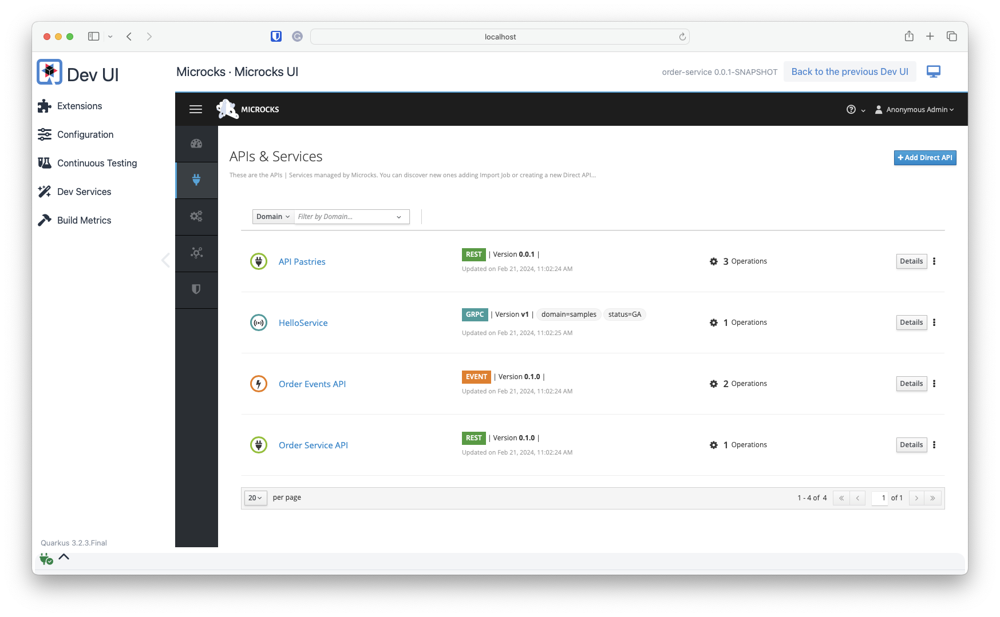

# Step 3: Local development experience with Microcks

Our application uses Kafka and external dependencies.

At first, if you run the application from your terminal without integrating Microcks, you would see the following traces:

```shell
./mvnw clean quarkus:dev -Dquarkus.microcks.devservices.enabled=false

[INFO] Scanning for projects...
[INFO] 
[INFO] -----------------------< org.acme:order-service >-----------------------
[INFO] Building order-service 0.0.1-SNAPSHOT
[INFO]   from pom.xml
[INFO] --------------------------------[ jar ]---------------------------------
[INFO] 
[INFO] --- clean:3.2.0:clean (default-clean) @ order-service ---
[INFO] Deleting /Users/laurent/Development/github/microcks-quarkus-workshop/target
[INFO] 
[INFO] --- quarkus:3.24.5:dev (default-cli) @ order-service ---
[INFO] Invoking resources:3.3.0:resources (default-resources) @ order-service
[INFO] Copying 6 resources
[INFO] Invoking quarkus:3.24.5:generate-code (default) @ order-service
[INFO] Invoking compiler:3.14.1:compile (default-compile) @ order-service
[INFO] Recompiling the module because of changed source code.
[INFO] Compiling 14 source files with javac [debug release 17] to target/classes
[INFO] Invoking resources:3.3.0:testResources (default-testResources) @ order-service
[INFO] Copying 5 resources
[INFO] Invoking quarkus:3.24.5:generate-code-tests (default) @ order-service
[INFO] Invoking compiler:3.14.1:testCompile (default-testCompile) @ order-service
[INFO] Recompiling the module because of changed dependency.
Listening for transport dt_socket at address: 5005
2025-10-10 13:17:09,383 INFO  [io.qua.sma.dep.processor] (build-40) Generating Jackson deserializer for type org.acme.order.service.model.OrderEvent
2025-10-10 13:17:09,385 INFO  [io.qua.sma.dep.processor] (build-40) Generating Jackson serializer for type org.acme.order.service.model.OrderEvent
2025-10-10 13:17:10,950 INFO  [io.qua.kaf.cli.dep.DevServicesKafkaProcessor] (build-6) Dev Services for Kafka started. Other Quarkus applications in dev mode will find the broker automatically. For Quarkus applications in production mode, you can connect to this by starting your application with -Dkafka.bootstrap.servers=OUTSIDE://localhost:56535
__  ____  __  _____   ___  __ ____  ______ 
 --/ __ \/ / / / _ | / _ \/ //_/ / / / __/ 
 -/ /_/ / /_/ / __ |/ , _/ ,< / /_/ /\ \   
--\___\_\____/_/ |_/_/|_/_/|_|\____/___/   
2025-10-10 13:17:11,444 INFO  [io.sma.rea.mes.kafka] (Quarkus Main Thread) SRMSG18214: Key deserializer omitted, using String as default[OrderEventsAPI-0.1.0-orders-reviewed]
[...]
2025-10-10 13:17:11,593 INFO  [io.sma.rea.mes.kafka] (smallrye-kafka-producer-thread-0) SRMSG18258: Kafka producer kafka-producer-orders-created, connected to Kafka brokers 'OUTSIDE://localhost:56535', is configured to write records to 'orders-created'
2025-10-10 13:17:11,609 INFO  [io.sma.rea.mes.kafka] (smallrye-kafka-consumer-thread-0) SRMSG18257: Kafka consumer kafka-consumer-orders-reviewed, connected to Kafka brokers 'OUTSIDE://localhost:56535', belongs to the 'order-service' consumer group and is configured to poll records from [OrderEventsAPI-0.1.0-orders-reviewed]
2025-10-10 13:17:11,653 INFO  [io.quarkus] (Quarkus Main Thread) order-service 0.0.1-SNAPSHOT on JVM (powered by Quarkus 3.24.5) started in 3.253s. Listening on: http://localhost:8080
2025-10-10 13:17:11,653 INFO  [io.quarkus] (Quarkus Main Thread) Profile dev activated. Live Coding activated.
2025-10-10 13:17:11,653 INFO  [io.quarkus] (Quarkus Main Thread) Installed features: [cdi, compose, kafka-client, messaging, messaging-kafka, rest, rest-client, rest-client-jackson, rest-jackson, smallrye-context-propagation, vertx]

--
Tests paused
Press [e] to edit command line args (currently ''), [r] to resume testing, [o] Toggle test output, [:] for the terminal, [h] for more options>
```

You can see that [Dev Services for Kafka](https://quarkus.io/guides/kafka-dev-services) are started automatically because we included a Kafka client into our project dependencies. However, there's no such default Dev Services when using the Rest client to call our external Pastry API provider!

Just issue a simple API request using CURL or Postman or any of your favourite HTTP Client tools. 

```shell
curl -v -X POST localhost:8080/api/orders -H 'Content-type: application/json' \
    -d '{"customerId": "lbroudoux", "productQuantities": [{"productName": "Eclair Cafe", "quantity": 1}], "totalPrice": 4.1}'
```

You should get a response similar to the following:

```shell
< HTTP/1.1 500 Internal Server Error
< content-length: 0
< 
* Connection #0 to host localhost left intact
```

and on the terminal where application is running, something like this:

```shell
ERROR [org.acm.ord.api.OrderResource] (executor-thread-1) Unexpected runtime exception: Error injecting org.acme.order.client.PastryAPIClient org.acme.order.service.OrderService.pastryRepository: java.lang.RuntimeException: Error injecting org.acme.order.client.PastryAPIClient org.acme.order.service.OrderService.pastryRepository
[...]
Caused by: java.lang.IllegalArgumentException: Unable to determine the proper baseUrl/baseUri. Consider registering using @RegisterRestClient(baseUri="someuri"), @RegisterRestClient(configKey="orkey"), or by adding 'quarkus.rest-client.pastries.url' or 'quarkus.rest-client.pastries.uri' to your Quarkus configuration
```

To run this application locally, we need [Microcks Dev Services](https://github.com/microcks/microcks-quarkus) 🪄 to have our Pastry API mocked!

In order to see what's needed to run this, you may check the `pom.xml` and `application.properties` files.

## Review pom.xml and application.properties

First, the `quarkus-microcks` dependency must be added to your project dependencies like illustrated below:

[`pom.xml`](pom.xml):
```xml
<dependency>
  <groupId>io.github.microcks.quarkus</groupId>
  <artifactId>quarkus-microcks</artifactId>
  <version>${quarkus-microcks.version}</version>
  <scope>provided</scope>
</dependency>
```

The dependency scope can be set to `provided` as this dependency will only be used during development mode or unit tests. You don't need to package them into
your application.

In order to wire the application to Microcks, we also need to update the [`application.properties`](src/main/resources/application.properties) file so that we specify to Microcks
provided endpoints for both the Pastry API REST endpoint and the Kafka topic for receiving reviewed orders:

```properties
quarkus.rest-client.pastries.url=${quarkus.microcks.default.http}/rest/API+Pastries/0.0.1

mp.messaging.incoming.orders-reviewed.topic=OrderEventsAPI-0.1.0-orders-reviewed
```

> [!NOTE]
> You'll notice that we use `${quarkus.microcks.default.http}` expression to specify the dynamically assigned Microcks HTTP endpoint.

## Application startup with Microcks DevServices

Now that we've got everything configured, we can start again the application. In the traces below, we only kept the significant parts related to Microcks DevServices usage:

```shell
./mvnw clean quarkus:dev 

[INFO] -----------------------< org.acme:order-service >-----------------------
[INFO] Building order-service 0.0.1-SNAPSHOT
[INFO]   from pom.xml
[INFO] --------------------------------[ jar ]---------------------------------
[INFO] 
[INFO] --- clean:3.2.0:clean (default-clean) @ order-service ---
[INFO] Deleting /Users/laurent/Development/github/microcks-quarkus-workshop/target
[INFO] 
[INFO] --- quarkus:3.24.5:dev (default-cli) @ order-service ---
[INFO] Invoking resources:3.3.0:resources (default-resources) @ order-service
[INFO] Copying 6 resources
[INFO] Invoking quarkus:3.24.5:generate-code (default) @ order-service
[INFO] Invoking compiler:3.14.1:compile (default-compile) @ order-service
[INFO] Recompiling the module because of changed source code.
[INFO] Compiling 14 source files with javac [debug release 17] to target/classes
[INFO] Invoking resources:3.3.0:testResources (default-testResources) @ order-service
[INFO] Copying 5 resources
[INFO] Invoking quarkus:3.24.5:generate-code-tests (default) @ order-service
[INFO] Invoking compiler:3.14.1:testCompile (default-testCompile) @ order-service
[INFO] Recompiling the module because of changed dependency.
Listening for transport dt_socket at address: 5005
2025-10-10 13:24:51,326 INFO  [io.qua.sma.dep.processor] (build-25) Generating Jackson deserializer for type org.acme.order.service.model.OrderEvent
2025-10-10 13:24:51,329 INFO  [io.qua.sma.dep.processor] (build-25) Generating Jackson serializer for type org.acme.order.service.model.OrderEvent
2025-10-10 13:24:52,859 INFO  [io.qua.kaf.cli.dep.DevServicesKafkaProcessor] (build-49) Dev Services for Kafka started. Other Quarkus applications in dev mode will find the broker automatically. For Quarkus applications in production mode, you can connect to this by starting your application with -Dkafka.bootstrap.servers=PLAINTEXT://redpanda-xq7r6:29092,OUTSIDE://localhost:56542

2025-10-10 13:26:04,858 INFO  [io.git.mic.qua.dep.DevServicesMicrocksProcessor] (build-40) The 'default' microcks container is ready on http://localhost:63445
2025-10-10 13:26:04,862 INFO  [tc.qua.io/microcks/microcks-uber-async-minion:latest] (build-22) Creating container for image: quay.io/microcks/microcks-uber-async-minion:latest
2025-10-10 13:26:04,920 INFO  [tc.qua.io/microcks/microcks-uber-async-minion:latest] (build-22) Container quay.io/microcks/microcks-uber-async-minion:latest is starting: 1dda5cc4368d41673e172e65ee7877320fc0fbf08ec758ee5bf0fa4fc07650b8
2025-10-10 13:26:07,372 INFO  [tc.qua.io/microcks/microcks-uber-async-minion:latest] (build-22) Container quay.io/microcks/microcks-uber-async-minion:latest started in PT2.509787S
__  ____  __  _____   ___  __ ____  ______ 
 --/ __ \/ / / / _ | / _ \/ //_/ / / / __/ 
 -/ /_/ / /_/ / __ |/ , _/ ,< / /_/ /\ \   
--\___\_\____/_/ |_/_/|_/_/|_|\____/___/   
2025-10-10 13:26:07,645 WARN  [io.qua.config] (Quarkus Main Thread) Unrecognized configuration key "quarkus.microcks.default.secondary-artifacts" was provided; it will be ignored; verify that the dependency extension for this configuration is set or that you did not make a typo
2025-10-10 13:26:07,645 WARN  [io.qua.config] (Quarkus Main Thread) Unrecognized configuration key "quarkus.microcks.default.grpc.host" was provided; it will be ignored; verify that the dependency extension for this configuration is set or that you did not make a typo
2025-10-10 13:26:07,645 WARN  [io.qua.config] (Quarkus Main Thread) Unrecognized configuration key "quarkus.microcks.default.http.port" was provided; it will be ignored; verify that the dependency extension for this configuration is set or that you did not make a typo
2025-10-10 13:26:07,645 WARN  [io.qua.config] (Quarkus Main Thread) Unrecognized configuration key "quarkus.microcks.default.http" was provided; it will be ignored; verify that the dependency extension for this configuration is set or that you did not make a typo
2025-10-10 13:26:07,645 WARN  [io.qua.config] (Quarkus Main Thread) Unrecognized configuration key "quarkus.microcks.default.grpc.port" was provided; it will be ignored; verify that the dependency extension for this configuration is set or that you did not make a typo
2025-10-10 13:26:07,645 WARN  [io.qua.config] (Quarkus Main Thread) Unrecognized configuration key "quarkus.microcks.default.grpc" was provided; it will be ignored; verify that the dependency extension for this configuration is set or that you did not make a typo
2025-10-10 13:26:07,645 WARN  [io.qua.config] (Quarkus Main Thread) Unrecognized configuration key "quarkus.microcks.default.primary-artifacts" was provided; it will be ignored; verify that the dependency extension for this configuration is set or that you did not make a typo
2025-10-10 13:26:07,645 WARN  [io.qua.config] (Quarkus Main Thread) Unrecognized configuration key "quarkus.microcks.default.http.host" was provided; it will be ignored; verify that the dependency extension for this configuration is set or that you did not make a typo
2025-10-10 13:26:07,730 INFO  [io.sma.rea.mes.kafka] (Quarkus Main Thread) SRMSG18229: Configured topics for channel 'orders-reviewed': [OrderEventsAPI-0.1.0-orders-reviewed]
2025-10-10 13:26:07,737 INFO  [io.sma.rea.mes.kafka] (Quarkus Main Thread) SRMSG18214: Key deserializer omitted, using String as default
[...]
2025-10-10 13:26:07,961 WARN  [org.apa.kaf.cli.ClientUtils] (smallrye-kafka-producer-thread-0) Couldn't resolve server PLAINTEXT://redpanda-xq7r6:29092 from bootstrap.servers as DNS resolution failed for redpanda-xq7r6
2025-10-10 13:26:07,965 INFO  [io.sma.rea.mes.kafka] (smallrye-kafka-producer-thread-0) SRMSG18258: Kafka producer kafka-producer-orders-created, connected to Kafka brokers 'PLAINTEXT://redpanda-xq7r6:29092,OUTSIDE://localhost:56542', is configured to write records to 'orders-created'
2025-10-10 13:26:07,983 INFO  [io.sma.rea.mes.kafka] (smallrye-kafka-consumer-thread-0) SRMSG18257: Kafka consumer kafka-consumer-orders-reviewed, connected to Kafka brokers 'PLAINTEXT://redpanda-xq7r6:29092,OUTSIDE://localhost:56542', belongs to the 'order-service' consumer group and is configured to poll records from [OrderEventsAPI-0.1.0-orders-reviewed]
Microcks DevServices has been initialized
2025-10-10 13:26:08,030 INFO  [io.quarkus] (Quarkus Main Thread) order-service 0.0.1-SNAPSHOT on JVM (powered by Quarkus 3.24.5) started in 77.683s. Listening on: http://localhost:8080
2025-10-10 13:26:08,030 INFO  [io.quarkus] (Quarkus Main Thread) Profile dev activated. Live Coding activated.
2025-10-10 13:26:08,030 INFO  [io.quarkus] (Quarkus Main Thread) Installed features: [cdi, compose, kafka-client, messaging, messaging-kafka, microcks, rest, rest-client, rest-client-jackson, rest-jackson, smallrye-context-propagation, vertx]
2025-10-10 13:26:11,377 INFO  [io.sma.rea.mes.kafka] (vert.x-eventloop-thread-3) SRMSG18256: Initialize record store for topic-partition 'OrderEventsAPI-0.1.0-orders-reviewed-0' at position -1.
2025-10-10 13:26:11,397 INFO  [org.acm.ord.ser.OrderEventListener] (vert.x-worker-thread-1) Receiving a reviewed order with id '123-456-789' for 'lbroudoux'
[...]
```

Let's understand why we got those messages at startup:

* First, you can see that the `DevServicesKafkaProcessor` output is a bit different... This time we have a `PLAINTEXT://redpanda-xq7r6:29092` endpoint and this one will be used by Microcks DevServices.
* Second, you can see that the `DevServicesMicrocksProcessor` is starting a Microcks container that will be available at `http://localhost:63445`.
* Then, you can see that this processor is also starting a some other containers like `microcks-postman-runtime` and `microcks-uber-async-minion`.
  This is not always the case and depends on your project configuration. Those services have been started here because we have Postman Collection files in our resources and because we have a Kafka broker running.
* Just after the Quarkus logo, you can see that Microcks DevServices as also contributed a bunch of `quarkus.microcks.*` properties
* Finally, after the application has started, you'll see messages about `Receiving a reviewed order with id...` that means that Microcks has started producing mock messages and the application is processing them.

And that's it! 🎉 You don't need to download and install extra-things, or clone other repositories and figure out how to start your dependant services.

You can get a visual confirmation that everything is running by accessing the Quarkus Dev Console.

Open a browser to `http://localhost:8080/q/dev-ui`, and click the `Microcks UI` link on the Microcks extension tile. You'll get access to the running Microcks container and will be able to check the discovered and loaded APIs:



Now, you can invoke the APIs using CURL or Postman or any of your favourite HTTP Client tools.

## Create an order

```shell
curl -v -X POST localhost:8080/api/orders -H 'Content-type: application/json' \
    -d '{"customerId": "lbroudoux", "productQuantities": [{"productName": "Millefeuille", "quantity": 1}], "totalPrice": 5.1}'
```

You should get a response similar to the following:

```shell
< HTTP/1.1 201 
< Content-Type: application/json;charset=UTF-8
< content-length: 172
< 
* Connection #0 to host localhost left intact
{"id":"0ddb2ad0-a74d-4b1c-84bc-f272349ef091","status":"CREATED","customerId":"lbroudoux","productQuantities":[{"productName":"Millefeuille","quantity":1}],"totalPrice":5.1}%
```

Now test with something else, requesting for another Pastry:

```shell
curl -v -X POST localhost:8080/api/orders -H 'Content-type: application/json' \
    -d '{"customerId": "lbroudoux", "productQuantities": [{"productName": "Eclair Chocolat", "quantity": 1}], "totalPrice": 4.1}' -v
```

This time you get another "exception" response:

```shell
< HTTP/1.1 422 Unprocessable Entity
< Content-Type: application/json;charset=UTF-8
< content-length: 85
< 
* Connection #0 to host localhost left intact
{"productName":"Eclair Chocolat","details":"Pastry Eclair Chocolat is not available"}%
```

and this is because Microcks has created different simulations for the Pastry API 3rd party API based on API artifacts we loaded.

Check the [`apipastries-openapi.yaml`](src/test/resources/third-parties/apipastries-openapi.yaml) and [`apipastries-postman-collection.json`](src/test/resources/third-parties/apipastries-postman-collection.json) files to get details.

### 
[Next](step-4-write-rest-tests.md)